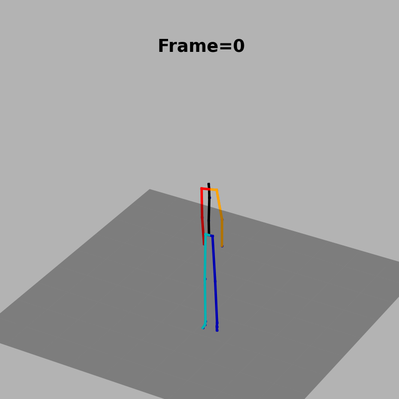
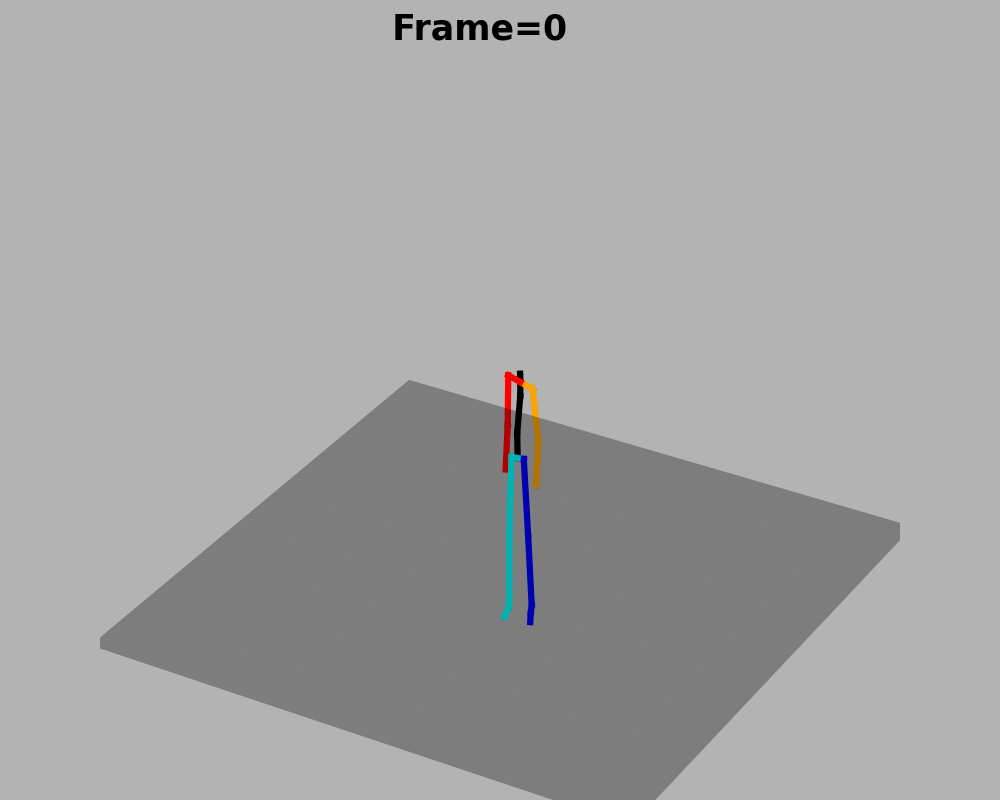

# Description 

Official implementation of our paper for synchronized motion to text generation:

<div align="center">

[Motion2Language, unsupervised learning of synchronized semantic motion segmentation](https://arxiv.org/pdf/2310.10594) 

[](https://arxiv.org/abs/2310.10594)
[](https://rd20karim.github.io/m2t-seg-web/)
[](https://rdcu.be/dtylu)
[]()
[](https://paperswithcode.com/sota/motion-captioning-on-humanml3d?p=motion2language-unsupervised-learning-of)
[](https://paperswithcode.com/sota/motion-captioning-on-kit-motion-language?p=motion2language-unsupervised-learning-of)

</div>

* In this project, we introduce **synchronized captioning of 3D human motion**.

* This work aims to present first experiments for progressive text generation in synchronization with motion action times.

<div align="center">
    <span style="color:darkblue; font-weight:bold; font-size: 25px">KIT-ML</span>
</div>

<div align="center">
  
  
  
</div>

<div align="center">
    <span style="color:darkblue; font-weight:bold; font-size: 25px">HumanML3D</span>
</div>

<div align="center">
  
  
  
</div>


If you find this code useful in your work, please cite:

```markdown
@article{radouane23motion2language,
   author={Radouane, Karim and Tchechmedjiev, Andon and Lagarde, Julien and Ranwez, Sylvie},
   title={Motion2language, unsupervised learning of synchronized semantic motion segmentation},
   journal={Neural Computing and Applications},
   ISSN={1433-3058},
   url={http://dx.doi.org/10.1007/s00521-023-09227-z},
   DOI={10.1007/s00521-023-09227-z},
   publisher={Springer Science and Business Media LLC},
   year={2023},
   month=dec}
```


# Installation

```
conda env create -f environment.yaml
conda activate raypy310
python -m spacy download en-core-web-sm
```
# Preprocess dataset

* Original KIT version

You can find the pre-processed version of this dataset here [Pre-processed KIT-ML](https://drive.google.com/drive/folders/1zkJ4LnGV64Ne5ZlRy2aWH1sXcH_aVFF8?usp=drive_link).
Next, you can set the directories of each file in ``` 'path_txt' and 'path_motion'``` variables of `evaluate_m2l.py` file.

If you use the KIT Motion-Language dataset, please cite the following paper : [Original KIT](https://www.liebertpub.com/doi/abs/10.1089/big.2016.0028?journalCode=big)

* Augmented KIT-ML version and HumanML3D

You can download both datasets following the steps at this repository [Augmented datasets](https://github.com/EricGuo5513/HumanML3D).

In this case you need to perform these pre-processing steps for text corrections and motion normalization.

1) Use the ```datasets/build_data.py``` to build the dataset, set the absolute path of the selected dataset in each case.
2) The step 1 will save a numpy file to the specified path, set this path directory to ```path``` variable to dataset class (HumanML3D:  ```datasets/h3d_m2t_dataset_.py``` or KIT-ML :  ```datasets/kit_m2t_dataset.py``` ) and run this file.
3) The step 2 will generate ```sentences_corrections.csv``` file, the absolute path of this file define ```path_txt``` and numpy file generated at step 1 define ```path_motion```.


# Download Pretrained Models

* Original KIT version

Models with different configurations are available here: [Models Original KIT](https://drive.google.com/drive/folders/1-lgI-d8A1iZPBDH0K4hw22g0tpbggT6H?usp=drive_link)

* Augmented KIT-ML version and HumanML3D

Models for both datasets are available here: [Models](https://drive.google.com/drive/folders/13Mvll7JcOW--NI8elQQr3C0b2MSpB0GZ?usp=sharing)

In the following for each python script, all available choices can be displayed by running ``` python name_script.py --help ```

# Training
As described in the paper [Motion2Language](https://arxiv.org/abs/2310.10594) the attention mechanisms was done as follows:

_**Soft Attention:**_
Experimented with a model employing a GRU encoder for both Cartesian and angles input types.

_**Local Attention:**_
Explored a GRU encoder-based model specifically designed for Cartesian input.

_**Local Recurrent Attention:**_
Conducted experiments with models utilizing various encoder types, all tailored for Cartesian input.


```
python tune_train.py --input_type INPUT_TYPE --encoder_type ENCODER_TYPE --attention_type ATTENTION_TYPE 
```

Or simply, you can set a configuration path that specifies the model to train and the hyperparameters to experiment with. Additional values can be modified by updating the configuration file of the selected model.

```
python tune_train.py  --config CONFIG_PATH 
```

# Examples
### Using joint angles/ Soft attention
```
python tune_train.py --input_type angles --encoder_type BiGRU --attention_type soft
```
or 
```
python tune_train.py --config ../configs/BiGRU.yaml
```
 
### Using cartesian coordinates/ Local recurrent attention

```
python tune_train.py  --config ./configs/MLP.yaml

python tune_train.py  --config ./configs_h3D/MLP_tune.yaml --dataset_name h3D

python tune_train.py  --config ./configs_kit_aug/MLP_train.yaml --dataset_name kit

```

# Run evaluation

## General
```
python evaluate_m2L.py --path PATH --input_type INPUT_TYPE --encoder_type ENCODER_TYPE --attention_type ATTENTION_TYPE --D D --mask MASK --subset SUBSET
```

``` D ``` and ``` mask ``` arguments should be specified only in the case of local attention mode, default is  ``` D=5; mask=True ```

or using a config file :
```
python src/evaluate_m2L.py --config ./configs/soft/GRU.yaml
```

## BLEU score : corpus level

First, to obtain a corpus-level BLEU score, the batch size should be the size of the evaluation subset.
If memory is not sufficient, you can use the CSV file of the output predictions. 
Set this path in ```bleu_from_csv.py``` and run this script to compute NLP metric scores.

```
python src/evaluate_m2L.py --config  CONFIG_PATH
```
Config Path Format : ```f./configs/{attention_type}/{encoder_type}_{input_type}.yaml```

The ```input_type``` ìs by default set to "_cartesian_".

Different values of D
``` python src/evaluate_m2L.py --config ./configs/local_rec/MLP_D=9.yaml ```

##  Augmented KIT and HumanML3D

In this case the argument ```dataset_name``` should be specified, the default was _kit2016._

1) KIT-MLD Augmented dataset
* MLP: ``` python src/evaluate_m2L.py --config ./configs_kit_aug/MLP.yaml --dataset_name kit ```
* deep-MLP: ``` python src/evaluate_m2L.py --config ./configs_kit_aug/deep-MLP.yaml --dataset_name kit ```

2) HumanML3D
* MLP: ``` python src/evaluate_m2L.py --config ./configs_h3D/MLP.yaml --dataset_name h3D```

# Visualizations 


**_1. Human Pose Animation_**

Generate skeleton animation with synchronized text (specially to run with model based on local recurrent attention for better plot, local attention can be used to compare visually both synchronization performances)

* Run with the default model
```
python visualizations/poses2concepts.py --n_map NUMBER_ATTENTION_MAP --n_gifs NUMBER_3D_ANIMATIONS --save_results DIRECTORY_SAVE_PLOTS
```

or using a config file

* Examples
```
python visualizations/poses2concepts.py --config ./configs/local_rec/MLP.yaml --n_map 1 --n_gifs 105 --save_results ./gifs_map_orig

python visualizations/poses2concepts.py --config ./configs_kit_aug/MLP.yaml --dataset_name kit --n_map 5 --n_gifs 50 --save_results ./gifs_map_kit22_

python visualizations/poses2concepts.py --config ./configs_h3D/MLP.yaml --dataset_name h3D --n_map 1 --n_gifs 100 --save_results ./gifs_map_h3D_b_1

```


**_2. Frozen in Time_**

To visualize frozen motion for the analysis of motion-language synchronization perception, 
you can use _froze_motion.py_. More details will be added later on.

# Beam search
Beam searching can simply be done by adding the argument of the beam size ```--beam_size``` 
```
python src/evaluate_m2L.py --config ./configs/local_rec/deep-MLP.yaml --beam_size 1
```
BEAM_SIZE : (=1 default : Greedy search) (>1 for beam searching)  
This script will print the BLEU-4 score for each beam and write beam predictions under the file ```result_beam_size_{BEAM_SIZE}_.txt```


## Segmentation scores

* Only for the original KIT-ML dataset

The main script to run for separate segmentation results :

* Evaluate segmentation results of one model
```  python src/seg_eval.py --config CONFIG_PATH  ```

* Compare segmentation of multiple models

``` python src/segmentation_eval.py ```
This script generates segmentation score curves and saves them as figures in the working directory.

**Examples**
* MLP : ```python src/seg_eval.py --config ./configs/local_rec/MLP.yaml```
* Deep-MLP : ```python src/seg_eval.py --config ./configs/local_rec/deep-MLP.yaml```


## Main paper results

Soft attention :
* GRU-Angles  :  ``` python src/evaluate_m2L.py --config ./configs/soft/GRU_angles.yaml ```
* BiGRU-Angles : ``` python src/evaluate_m2L.py --config  ./configs/soft/BiGRU_angles.yaml ```

Local attention :
* GRU-Cartesian : ``` python src/evaluate_m2L.py --config ./configs/local/GRU.yaml ```
* BiGRU-Cartesian : ``` python src/evaluate_m2L.py --config ./configs/local/BiGRU.yaml ```

Local recurrent attention :
* GRU-Cartesian : ``` python src/evaluate_m2L.py --config ./configs/local_rec/GRU.yaml ```
* BiGRU-Cartesian : ``` python src/evaluate_m2L.py --config ./configs/local_rec/BiGRU.yaml ```
* MLP : ``` python src/evaluate_m2L.py --config ./configs/local_rec/MLP.yaml ```
* deep-MLP : ``` python src/evaluate_m2L.py --config ./configs/local_rec/deep-MLP.yaml ```


# Notebook 

An interactive notebook demonstrating all functionalities of this project will be available soon.


# License 
This project is under [MIT license](https://github.com/rd20karim/M2T-Segmentation?tab=MIT-1-ov-file).